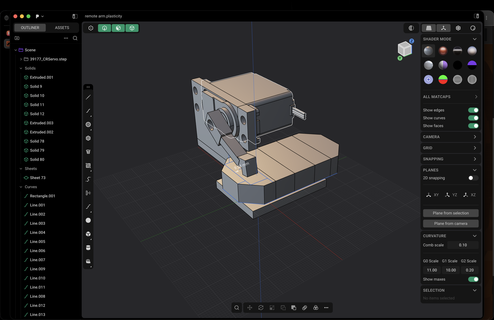
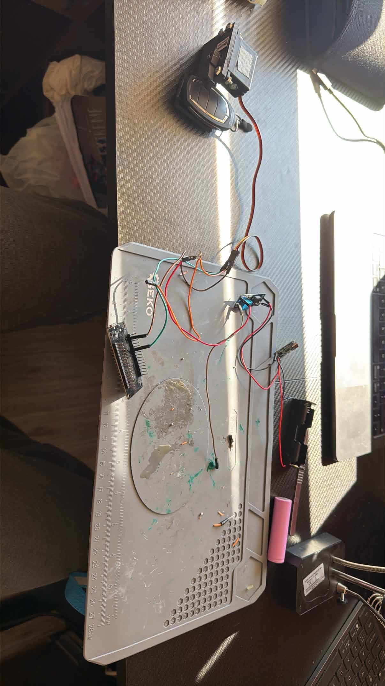
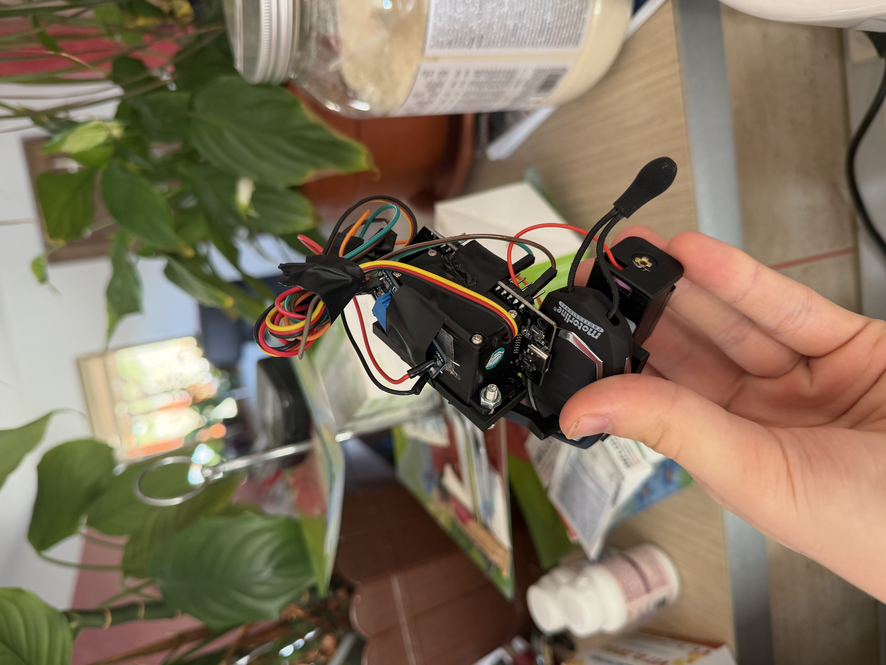
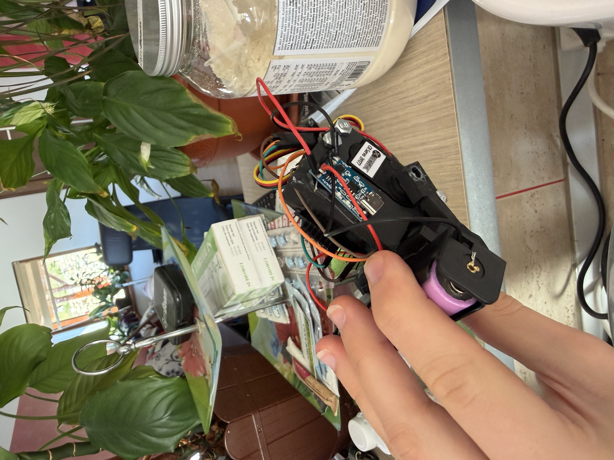

# DIY Home Assistant Gate Opener

A battery-powered ESP8266 and a continuous-rotation servo, in a case designed in [Plasticity](https://www.plasticity.xyz/). A button in Home Assistant runs a short forward move and a short return move. That bump is what opens the gate.

The servo has no position sensor, so the move is dead reckoning: degrees divided by a measured degrees-per-second. Forward and backward are tuned separately, and every one of those numbers is editable live in Home Assistant.



## What went into this one

The case was modeled in Plasticity around the TETRIX 39177 servo. The case was printed once. The little hand that sits on the servo axle took three prints, and it is held on with superglue.

Power is an 18650 soldered to a 1S charger board, then to a boost converter set to 6 V. Two wires leave that 6 V output: one to the ESP VIN pin, one to the servo power pin. Grounds are tied together, and the servo signal wire goes to D7.

The firmware is ESPHome. Home Assistant runs on a home server and is published with a Cloudflare Tunnel, so the same Bump button is available on a subdomain away from the house. After it all worked, the wiring was taped down so it would pack into the case.







## Bill of materials

Links, prices, and what each part does are in [BOM.md](BOM.md). Prices were checked on 30 Sep 2026 and do not include shipping.

One of each part is about **$58**. The ESP board is sold as a pair and the charger as a 10-pack, so buying the listings as they are sold is about **$72**.

## Wiring

Set the boost converter to 6 V with a multimeter **before** you connect the ESP or the servo. The trim pot can swing well past that.

```
18650  -->  1S charger  -->  boost converter (set to 6 V)
                                 |
                                 +--> ESP8266 VIN
                                 +--> servo power
                                 +--> common ground (ESP GND and servo ground)
ESP GPIO13 (D7)  -->  servo signal
```

D7 on the HW-625B silkscreen is GPIO13. The PWM rate is 50 Hz, the normal hobby-servo rate.

## Print the case

[`cad/remote-arm.stp`](cad/remote-arm.stp) is the Plasticity assembly. It includes the imported TETRIX servo (`39177_CRServo.step` in the screenshot) so the case and the hand sit correctly on the real part.

Print the case and the hand. The servo body in the file is the bought part, included for fit.

On this build the case fit on the first print. The hand took three tries before it would stay on the axle, and the one that fit is glued on.

## Flash the ESP8266

The config is [`esphome/crservo-controller.yaml`](esphome/crservo-controller.yaml). Put your Wi-Fi name and password in the `wifi:` block at the top before flashing.

### ESPHome dashboard

1. In Home Assistant, install the ESPHome Device Builder add-on and open it.
2. Create a device, open its YAML, and replace the contents with this file.
3. Plug the HW-625B in over USB and choose **Install**.

### Command line

```bash
pip install esphome
esphome run esphome/crservo-controller.yaml
```

The first flash needs the USB cable. Later updates can go over Wi-Fi. OTA is enabled with no password, which is fine on a network you control. There is no fallback hotspot: if the board cannot join Wi-Fi, flash it again over USB.

## Add it to Home Assistant

The device uses the ESPHome native API. Once it is on the same LAN as Home Assistant it shows up under **Settings → Devices & services**. Adopt it there.

These entities appear:

| Entity | What it does |
| --- | --- |
| **Bump** | The gate button. Spins forward, pauses 300 ms, spins back. |
| **CR Servo Stop** | Sets speed to 0. |
| **CR Servo Speed** | Manual slider, −100 (full reverse) to 100 (full forward). Comes back at 0 after a reboot or power loss. |
| **Bump Degrees Forward / Backward** | How far each half of the bump tries to go. |
| **Bump Speed Forward / Backward** | How hard each half spins, in percent. |
| **Bump DPS Forward / Backward** | Measured degrees per second at that speed. Used only for the timing math. |

Search for **Bump** when you add a dashboard card. The entity id is derived from the device name (`crservo-controller`), so picking it from the UI is more reliable than typing an id.

The numbers shipped in the YAML are the ones this build was tuned to:

| | Forward | Backward |
| --- | --- | --- |
| Degrees | 15 | 5 |
| Speed (%) | 18 | 18 |
| Degrees per second | 30 | 30 |

Degree, speed, and DPS values are restored after a reboot. The speed slider is not, so a power loss leaves the servo stopped.

## Tune the bump

The hand position is `time = degrees / degrees_per_second`. The TETRIX servo barely moves below about 5–8% speed, then speeds up steeply, and forward and backward do not match. That is why each direction has its own three numbers.

Changing a speed without remeasuring DPS makes the bump the wrong length. After you change **Bump Speed Forward** or **Bump Speed Backward**:

1. Set **CR Servo Speed** to that same percent. Positive is forward, negative is backward.
2. Let it run for one second, then press **CR Servo Stop**.
3. See how many degrees the hand actually moved.
4. Type that number into the matching **Bump DPS** box.

Those boxes take effect on the next press of **Bump**. No reflash.

If speed 0 still creeps, nudge `idle_level` in the YAML (it is 7.5%, about 1500 µs). If the two directions are lopsided at full speed, nudge `min_level` (3%) and `max_level` (12%). Leave `transition_length: 0s`. ESPHome otherwise ramps the pulse over a full second, and the short bump never reaches the speed you asked for.

## Reach the button from outside the house

Home Assistant on this project runs on a home server. A Cloudflare Tunnel publishes it on a subdomain of a domain you control. The phone loads that hostname, and the Bump button is the same entity as on the LAN.

The ESP8266 does not go through the tunnel. It only has to reach Home Assistant on the local network.

A minimal `cloudflared` ingress, with the hostname swapped for yours:

```yaml
tunnel: <tunnel-id>
credentials-file: /path/to/credentials.json

ingress:
  - hostname: ha.example.com
    service: http://localhost:8123
  - service: http_status:404
```

Point the hostname at Home Assistant's port (8123 on a default install). The ESPHome device still uses the local API.


## Demo

https://github.com/user-attachments/assets/e9069aea-7d2c-4d7b-ab31-095cc686b19b
